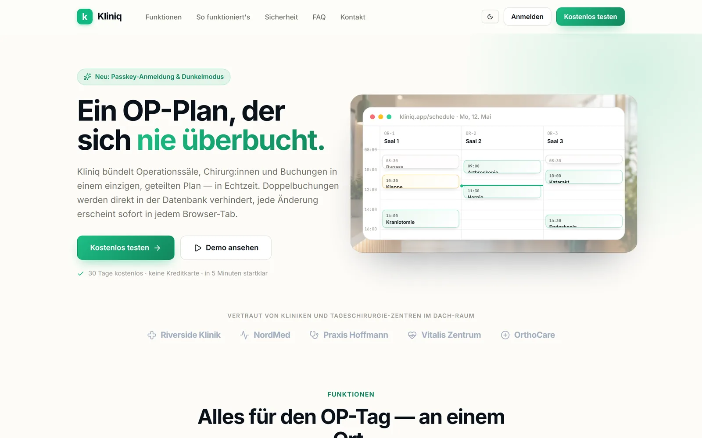
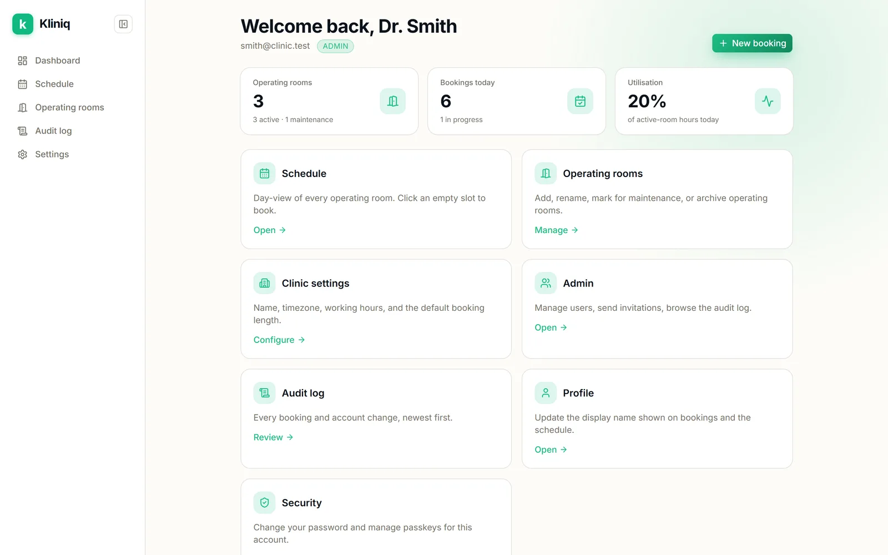
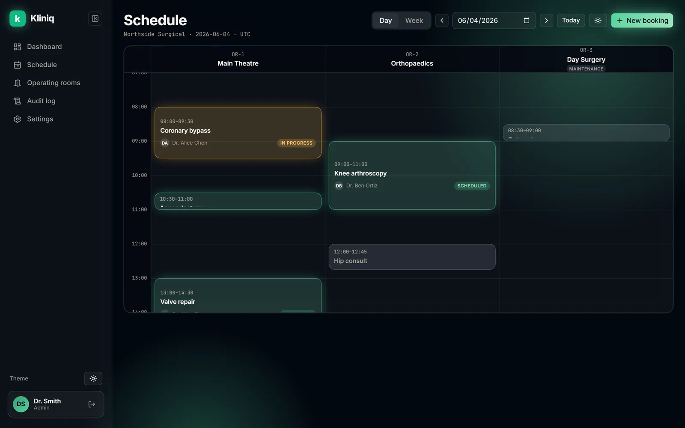
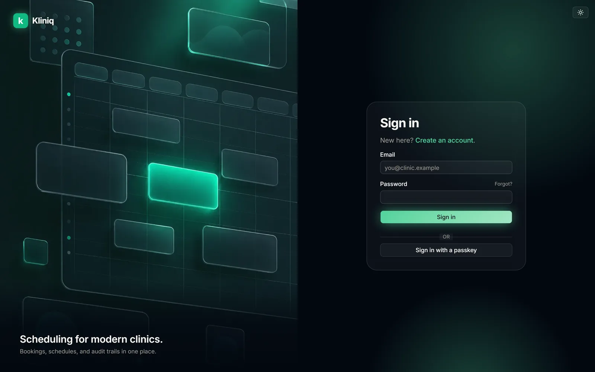
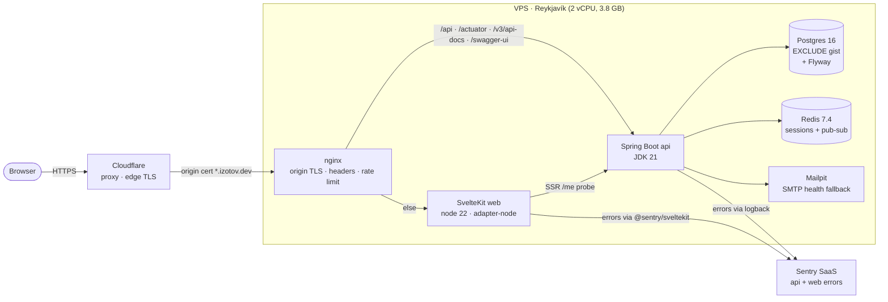

<p align="center">
  
</p>

<p align="center">
  <a href="https://github.com/oleksandr-izotov/kliniq/actions/workflows/ci.yml"></a>
  <a href="LICENSE"></a>
  <a href="https://kotlinlang.org"></a>
  <a href="https://spring.io/projects/spring-boot"></a>
  <a href="https://svelte.dev"></a>
  <a href="https://tailwindcss.com"></a>
</p>

# Kliniq

> Single-tenant operating-room scheduling SaaS for medical clinics. Clinic staff manage operating rooms, surgeons, and bookings on a shared schedule; the database refuses double-booked rooms at the row level (Postgres `EXCLUDE USING gist`), and the realtime backplane broadcasts every change to every open browser tab.

## Live demo

**→ <https://kliniq.izotov.dev>** — V1.1, [tagged `v1.0.0`](https://github.com/oleksandr-izotov/kliniq/releases/tag/v1.0.0), first shipped 2026-05-09. Now runs on a self-managed VPS in Reykjavík behind nginx and Cloudflare; see [Architecture](#architecture-prod).

Sign in with any of the demo surgeon accounts:

| Email | Password | Role |
| --- | --- | --- |
| `drsmith@kliniq-demo.local` | `DemoSurgeon2026!` | Manager · Cardiology |
| `drpatel@kliniq-demo.local` | `DemoSurgeon2026!` | Manager · Orthopedics |
| `drfischer@kliniq-demo.local` | `DemoSurgeon2026!` | Manager · Neurosurgery |
| `drkuznetsova@kliniq-demo.local` | `DemoSurgeon2026!` | Manager · General |

The schedule is pre-seeded with 3 operating rooms and ~10 bookings spread across the next two weeks. The seed is opt-in via the `APP_DEMO_SEED=true` env var so a real clinical deploy never receives it — see [`DemoDataSeeder.kt`](apps/api/src/main/kotlin/com/kliniq/infra/demo/DemoDataSeeder.kt).

**Status:** V1.1 — Sprint 5 (backups, Sentry, UptimeRobot, SSH/CSP hardening, demo data, onboarding wizard, README polish) in flight.
**Author:** Oleksandr Izotov ([@oleksandr-izotov](https://github.com/oleksandr-izotov))
**License:** MIT

---

## Screenshots

| Marketing landing — Luminous | Dashboard — Luminous |
| :---: | :---: |
| [](docs/screenshots/landing.webp) | [](docs/screenshots/dashboard.webp) |
| **Schedule day board — Midnight** | **Sign in — Midnight** |
| [](docs/screenshots/schedule.webp) | [](docs/screenshots/login.webp) |

> One theme switch, two skins — **Luminous** (warm near-white, soft depth) and **Midnight** (deep slate, glassmorphism, emerald glow). Self-hosted Inter + JetBrains Mono; a single emerald accent throughout. The German marketing landing lives at [`/welcome`](apps/web/src/routes/welcome/+page.svelte).

---

## Architecture (prod)



The api image is built from source and loaded onto the host: jOOQ generates its
code from a live database at compile time, and the deploy box has no JDK to run
that. CI still builds and pushes the same image to GHCR on merge to main. The web
image is built on the host — adapter-node's output is small enough that it costs
less than a second CI artifact pipeline.

**Ingress.** nginx is the single entry point and terminates TLS with a Cloudflare
Origin certificate covering `*.izotov.dev` — valid for 15 years, nothing to renew,
and useless to anyone but Cloudflare. The firewall opens 80/443 only to
Cloudflare's published ranges, so the origin cannot be reached directly, and
`set_real_ip_from` restores the visitor's address from `CF-Connecting-IP` before
rate limiting sees it.

Security headers live in a snippet included by every location block, because
nginx drops inherited `add_header` directives in any block that adds one of its
own. CSP is deliberately absent there: SvelteKit computes per-page hashes for its
inline hydration scripts and emits its own policy
([`apps/web/svelte.config.js`](apps/web/svelte.config.js) `kit.csp`) — a second
policy at the proxy would intersect with it and block hydration.

The realtime endpoint needs `proxy_buffering off`; with buffering on, nginx holds
server-sent events until its buffer fills, which for a quiet stream can be
minutes.

The full [`docs/RUNBOOK.md`](docs/RUNBOOK.md) covers SSH access, backups,
incident triage, and the env-var inventory.

## Engineering deep dive

Things in this codebase worth reading if you're looking at it as a hiring sample:

- **No two active bookings overlap on the same OR — enforced at the row level.** [`V3__booking_core.sql`](apps/api/src/main/resources/db/migration/V3__booking_core.sql) sets up an `EXCLUDE USING gist (operating_room_id WITH =, tstzrange(starts_at, ends_at, '[)') WITH &&)` predicate gated on `status IN ('SCHEDULED','IN_PROGRESS')`, which closes the TOCTOU window two "is the slot free?" requests could otherwise drive through.
- **Booking lifecycle is a real FSM, not a free-form status field.** [`Booking.kt:80`](apps/api/src/main/kotlin/com/kliniq/domain/booking/Booking.kt) defines the `SCHEDULED → IN_PROGRESS → COMPLETED` plus `→ CANCELLED` transitions and [`JooqBookingRepository.transitionStatus`](apps/api/src/main/kotlin/com/kliniq/persistence/booking/JooqBookingRepository.kt) does a compare-and-set against the expected current status so concurrent transitions can't both win.
- **Realtime updates fire only after the booking commits.** [`BookingPublishAfterCommitTest.kt`](apps/api/src/test/kotlin/com/kliniq/infra/realtime/BookingPublishAfterCommitTest.kt) asserts that a Redis pub-sub message lands only after the surrounding DB transaction commits, so other browser tabs never receive a "new booking" event that ends up being rolled back. [`BookingPubSubTwoInstancesTest.kt`](apps/api/src/test/kotlin/com/kliniq/infra/realtime/BookingPubSubTwoInstancesTest.kt) extends that to a two-instance setup proving the channel works across JVMs.
- **Auth surface has 60+ integration tests against real Postgres and Redis containers** via Testcontainers + `@ServiceConnection`. JaCoCo line coverage on `com.kliniq.usecase.auth` is ~89%.
- **Email senders are bean-swappable via `@ConditionalOnProperty`.** [`SmtpEmailSender`](apps/api/src/main/kotlin/com/kliniq/infra/mail/SmtpEmailSender.kt) wires when `app.mail.provider=smtp` (local dev with Mailpit); [`ResendApiEmailSender`](apps/api/src/main/kotlin/com/kliniq/infra/mail/ResendApiEmailSender.kt) wires when `app.mail.provider=resend` (prod). Cloud providers commonly block outbound SMTP on fresh accounts, so prod delivers over HTTPS instead of port 25.
- **CSP via SvelteKit, not Caddy.** SvelteKit emits a `<meta http-equiv="content-security-policy">` per page with sha256 hashes of its own inline hydration scripts; the corresponding Caddy `Content-Security-Policy` header is deliberately absent so the browser doesn't intersect-down to a policy that invalidates those hashes. See [`apps/web/svelte.config.js`](apps/web/svelte.config.js) and the "Security headers" section in [`docs/RUNBOOK.md`](docs/RUNBOOK.md).
- **CI → GHCR → deploy pipeline.** [`.github/workflows/ci.yml`](.github/workflows/ci.yml) — `api-image` job spins up a Postgres service container, builds the bootJar (running Flyway + jOOQ codegen against it), and pushes the runtime image to GHCR on every merge to main. The deploy host pulls that image; for the Reykjavik box the same image is built from source and loaded directly, since it has no JDK for jOOQ codegen.
- **Error tracking lands at Sentry from both sides.** api uses [`sentry-spring-boot-starter-jakarta`](apps/api/build.gradle.kts) with a logback appender — anything calling `logger.error(..., throwable)` becomes a Sentry event, no per-call instrumentation. web uses [`@sentry/sveltekit`](apps/web/svelte.config.js) wired in [`hooks.client.ts`](apps/web/src/hooks.client.ts) + [`hooks.server.ts`](apps/web/src/hooks.server.ts); source maps upload to Sentry at Docker build time so dashboard stack traces resolve to real `.svelte` / `.ts` files.

ADRs explaining the bigger decisions live in [`docs/DECISIONS.md`](docs/DECISIONS.md).

## Quick start (local)

Prereqs (Windows / macOS / Linux):

- [Node.js 20+](https://nodejs.org), [pnpm 10+](https://pnpm.io)
- JDK 21 ([Temurin](https://adoptium.net/) recommended)
- [Docker Desktop](https://www.docker.com/products/docker-desktop/)
- [mkcert](https://github.com/FiloSottile/mkcert) (`winget install FiloSottile.mkcert` or `brew install mkcert`)

```bash
# 1. Trust the local certificate authority once
mkcert -install

# 2. Generate dev TLS certs (gitignored)
cd certs
mkcert -cert-file localhost.pem -key-file localhost-key.pem localhost 127.0.0.1 ::1
openssl pkcs12 -export -in localhost.pem -inkey localhost-key.pem -out localhost.p12 -name kliniq-api -password pass:changeit
cd ..

# 3. Install monorepo dependencies (lefthook hooks auto-install)
pnpm install

# 4. One command brings up infra + backend + frontend with combined logs
pnpm dev:all
```

`pnpm dev:all` brings up the docker stack, waits for postgres / redis / mailpit to be ready, then runs `gradle bootRun` (the Spring app), `gradle --continuous build` (re-compiles on save so Spring DevTools can hot-restart), and `vite dev` together under [`concurrently`](https://www.npmjs.com/package/concurrently). One Ctrl-C tears everything down.

Then visit:

- **<https://localhost:5173>** — frontend (login + register + passkey-protected app)
- **<https://localhost:8443/actuator/health>** — backend health
- **<https://localhost:8443/swagger-ui.html>** — interactive Swagger UI (OpenAPI 3.1 spec at `/v3/api-docs`)
- **<http://localhost:8025>** — Mailpit web UI (catches outgoing dev mail)

If port 5432 is in use by a native postgres, our compose maps host port **55432** instead — config already accounts for this.

If you'd rather run pieces by hand: `pnpm infra:up`, `pnpm dev:api`, `pnpm dev:web`, `pnpm infra:down`. See `package.json` for the full script list.

### Regenerating the SPA's API types

The frontend's wire types live in [`apps/web/src/lib/api/generated.ts`](apps/web/src/lib/api/generated.ts), produced from the backend's OpenAPI spec. Whenever a controller or DTO changes:

```bash
# Backend must be running at https://localhost:8443
cd apps/web
pnpm gen:api
```

`generated.ts` is committed to git so the SPA builds without a live backend; CI catches drift via `svelte-check`.

## Deploy your own

See [`docs/RUNBOOK.md`](docs/RUNBOOK.md) for the full deploy and operations procedure, including:

- Provisioning, DNS setup (Cloudflare DNS-only mode for Let's Encrypt to work)
- Environment variables (`SENTRY_DSN`, `PUBLIC_SENTRY_DSN`, `APP_WEBAUTHN_RP_ID`, `APP_DEMO_SEED`, etc.)
- Daily pg_dump cron + the IPv6-aware healthcheck quirk
- Sentry verification, UptimeRobot setup, SSH hardening with `00-kliniq-hardening.conf`
- Common incidents — "site is down", "GHA built but the new image isn't running", "login succeeded but stuck on /login"

## Tech stack (V1.1)

- **Backend:** Kotlin 2.1 · Spring Boot 3.5 · Java 21 LTS · Flyway 10 · PostgreSQL 16 · Redis 7.4 · jOOQ 3.19 · WebAuthn4J · Argon2id · Sentry Spring Boot Starter 7.20
- **Frontend:** SvelteKit 2 · Svelte 5 (runes) · TypeScript 6 · Tailwind CSS v4 · shadcn-svelte · bits-ui · `@sentry/sveltekit` 10
- **Auth:** Spring Security + cookie sessions in Redis + WebAuthn4J passkeys (no JWT) + HIBP breach checks + per-IP exponential backoff
- **Tests:** JUnit 5 · Testcontainers (postgres + redis) · `@ServiceConnection` · `webauthn4j-test` virtual authenticator · Vitest · Playwright
- **Local infra:** Docker Compose · Mailpit · mkcert
- **CI:** GitHub Actions · gitleaks · commitlint · dependabot
- **Prod:** self-managed VPS in Reykjavík (2 vCPU + 3.8 GB) · Docker Compose · nginx · Cloudflare (proxy + origin cert) · Sentry

## Repository tour

| Path | What lives here |
|---|---|
| [`apps/api/`](apps/api/) | Kotlin + Spring Boot backend. Flyway migrations, jOOQ codegen, Spring Security, WebAuthn4J, mail senders, audit log, the booking FSM + EXCLUDE-overlap enforcement. |
| [`apps/web/`](apps/web/) | SvelteKit 2 frontend. Tailwind v4 + shadcn-svelte primitives, the onboarding wizard, Sentry wiring, CSP via `kit.csp`. |
| [`brand-assets/`](brand-assets/) | Logo, app icon, illustrations, OG image. |
| [`certs/`](certs/) | mkcert-issued local TLS material (gitignored). |
| [`docs/`](docs/) | Architecture, domain, ADRs, sprint plans, design system, prod runbook. Source of truth — start here. |
| [`compose.yaml`](compose.yaml) | Local infra: postgres 16, redis 7.4, mailpit. |
| [`compose.izotov.yaml`](compose.izotov.yaml) | Stack as actually deployed: same services minus Caddy, because nginx on the host already owns 80/443. |
| [`compose.prod.yaml`](compose.prod.yaml) | Reference prod stack with Caddy as ingress: postgres, redis, mailpit, api (image-only), web (built on-host), caddy (inline Caddyfile). |
| [`lefthook.yml`](lefthook.yml) | Pre-commit (gitleaks + lint) and pre-push (typecheck) hooks. |
| [`.github/workflows/ci.yml`](.github/workflows/ci.yml) | CI: api build + test + lint + image push to GHCR, web lint + typecheck + unit, gitleaks. |
| [`scripts/backup-pg.sh`](scripts/backup-pg.sh) | Daily 03:00 UTC `pg_dump`, 14-day retention. |

## Documentation

Read in this order to onboard:

1. [`docs/PLAN_NEXT.md`](docs/PLAN_NEXT.md) — the concrete plan for the next stretch: foundation, then recurring series, audit log UI and utilisation reports
2. [`docs/ROADMAP.md`](docs/ROADMAP.md) — V1 / V2 / V3 scope and acceptance criteria
3. [`docs/ARCHITECTURE.md`](docs/ARCHITECTURE.md) — system diagram, layers, tech rationale
4. [`docs/DOMAIN.md`](docs/DOMAIN.md) — entities, ER model, business rules
5. [`docs/REPO_STRUCTURE.md`](docs/REPO_STRUCTURE.md) — directory layout
6. [`docs/DECISIONS.md`](docs/DECISIONS.md) — architecture decision records
7. [`docs/RUNBOOK.md`](docs/RUNBOOK.md) — prod operations
8. [`docs/STYLE.md`](docs/STYLE.md) — Kliniq Emerald design system
9. [`docs/VISUALS.md`](docs/VISUALS.md) — visual style + AI prompts used to generate brand assets

Executable sprint plans:

- [`docs/sprints/SPRINT_0.md`](docs/sprints/SPRINT_0.md) — foundation **✓ done**
- [`docs/sprints/SPRINT_1.md`](docs/sprints/SPRINT_1.md) — authentication **✓ done**
- [`docs/sprints/SPRINT_2.md`](docs/sprints/SPRINT_2.md) — booking core **✓ done**
- [`docs/sprints/SPRINT_3.md`](docs/sprints/SPRINT_3.md) — realtime + admin **✓ done**
- [`docs/sprints/SPRINT_4.md`](docs/sprints/SPRINT_4.md) — V1 ship to prod **✓ done** (v1.0.0)
- [`docs/sprints/SPRINT_5.md`](docs/sprints/SPRINT_5.md) — V1.1 hardening + UX polish (in progress)

## Working principles

- **Every line of code is mine.** No copy-paste from other projects, no matter how similar.
- **Local-first.** V1 ran on a laptop before touching cloud infra.
- **Secrets never in git.** `.env.example` only. Pre-commit hook with gitleaks blocks accidents.
- **Tests on critical paths from day one** — auth, booking, realtime. Not "we'll add tests later."
- **Conventional Commits.** `feat:`, `fix:`, `chore:`, `docs:`, `refactor:`, `test:`.
- **Docs are source of truth.** If a decision isn't in `docs/`, it doesn't exist.

## If you (or an AI) pick this up later

The docs in `docs/` plus the README are designed to be self-contained. To resume work, point a new agent at:

1. This README
2. The current sprint file (`docs/sprints/SPRINT_*.md`)
3. The relevant ADRs (`docs/DECISIONS.md`)
4. The latest commits on `main` so it sees what's actually built vs planned
10. [`docs/RUNBOOK.md`](docs/RUNBOOK.md) when anything touches prod
